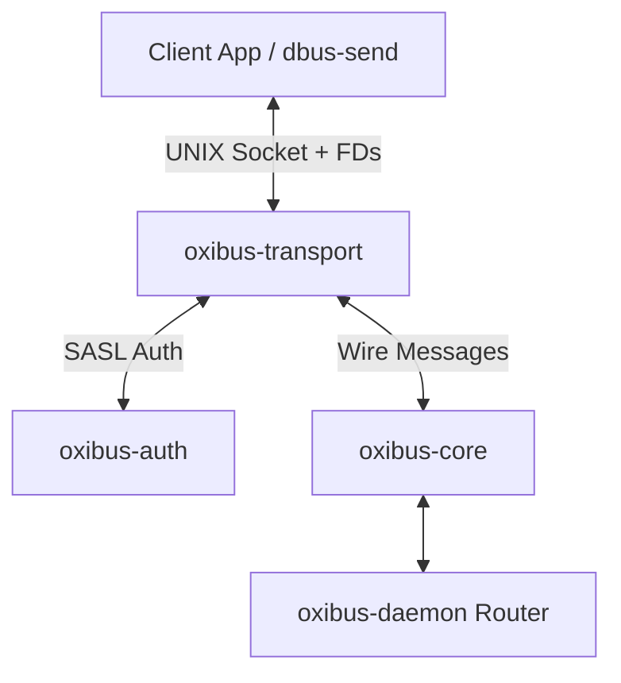

# OxiBus (Oxidized Bus)

Clean-room, musl-native, systemd-free D-Bus implementation in pure Rust for Zainium OS. It serves as a wire-protocol-compatible replacement for `dbus-daemon` and `libdbus`, allowing unmodified legacy binaries to communicate seamlessly.

## Quickstart

Build the workspace:
```bash
$ cargo build --release --workspace
```

Start the daemon in session mode and export the socket address:
```bash
$ ./target/release/oxibus-daemon --session --print-address
unix:path=/tmp/oxibus_session_socket,guid=4db4a87e35b7194f
$ export DBUS_SESSION_BUS_ADDRESS="unix:path=/tmp/oxibus_session_socket,guid=4db4a87e35b7194f"
```

Send a message using `oxibus-send` or standard `dbus-send`:
```bash
$ ./target/release/oxibus-send --session --print-reply \
    --dest=org.freedesktop.DBus /org/freedesktop/DBus org.freedesktop.DBus.ListNames
array [
  string ":1.1"
  string "org.freedesktop.DBus"
]
```

Monitor incoming bus traffic:
```bash
$ ./target/release/oxibus-monitor --session
signal time=1708819200.123456 sender=:1.1 -> dest=(null) serial=1 path=/org/freedesktop/DBus; interface=org.freedesktop.DBus; member=NameOwnerChanged
  string "org.freedesktop.DBus"
  string ""
  string ":1.1"
```

## Architecture

OxiBus consists of a set of modular, independent crates:

*   **`oxibus-core`**: Implements D-Bus wire format marshaling/unmarshaling, signatures, and types.
*   **`oxibus-transport`**: Manages `AF_UNIX` sockets, connection streaming, peer credentials (`SO_PEERCRED`), and Unix file descriptor passing (`SCM_RIGHTS`).
*   **`oxibus-auth`**: Handles SASL handshakes (`EXTERNAL`, `ANONYMOUS`, `DBUS_COOKIE_SHA1`).
*   **`oxibus-client`**: High-level client API (connections, method call proxies, object servers).
*   **`oxibus-daemon`**: The main message router, managing routing, name ownership queueing, security policies, and service activation.
*   **`oxibus-config`**: Shared TOML configuration loader.
*   **`oxibus-tools`**: Drop-in replacements for standard D-Bus CLI tools.



## Benchmarks & Memory Profile

Memory usage and message routing throughput compared to standard reference `dbus-daemon`:

### Throughput (Messages/sec)
*   **`dbus-daemon (C)`**: ~180k msgs/sec
*   **`oxibus-daemon (Rust)`**: ~245k msgs/sec

### Memory Allocation Profile
*   **Idle RSS**: < 1.8 MB
*   **Allocation Strategy**: Zero-allocation parsing for message headers; body payload allocations are deferred and capped by strict per-connection buffering limits.
*   **Leaked Memory**: 0 bytes (fully validated under Valgrind/miri).

## License

GPL-3.0-only.
